# How to Use Bluetooth (HC06) with AurixRacer

## Objectives

- HC-06의 보드레이트 설정을 **9600**에서 **115200**으로 변경한다.
- 페어링시 사용되는 HC-06의 **장치 이름(Device Name)**과 **핀  코드(Pincode)**를 변경한다.

## References

- [Bluetooth HC-06.pdf](https://github.com/realsosy/AurixTutorial/blob/master/references/Bluetooth%20HC-06.pdf)
- [Getting Started](https://github.com/realsosy/AurixRacer/blob/master/docs/GettingStarted.md)

## 하드웨어 결선도

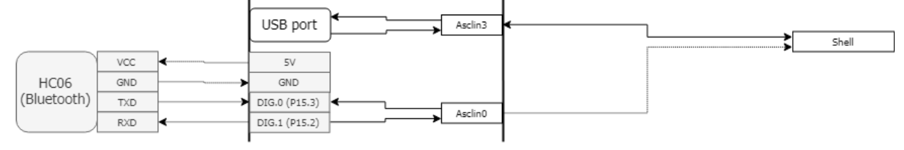

## HC-06 설정 변경

- BIFACES에 **AurixTurial.zip** 파일의 **MyIlldModule_SB_TC27D** 프로젝트를 Import 한다.

    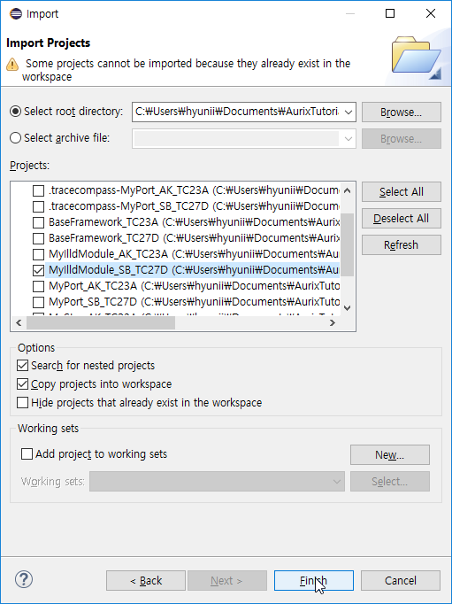

- Project explorer창에서 **0_Src >> AppSw >> MyllldModule >> AsclinAscBt >> Demo_lld** 안에 있는 **AsclinAscBtDemo.c**를 연다.

   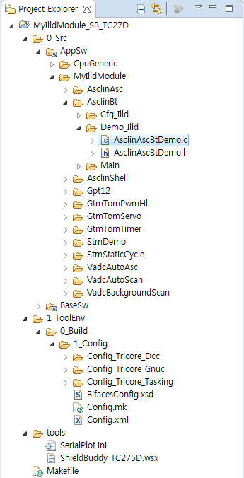

- **AsclinAscBtDemo.c**의 **AsclinAscBtDemo_init**함수

  - 보드레이트 설정

    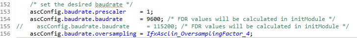

    - TC275 보드의 보드레이트 설정이다.

    - HC-06의 구매시 초기 보드레이트는 **9600** 이다.

    - **HC-06과 TC275 보드의 보드레이트가 일치해야한다.**

- **AsclinAscBtDemo.c**의 **AsclinAscBtDemo_run**함수

  - 장치명 설정

   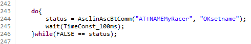

    - 페어링시 검색되는 장치의 이름을 설정하는 명령어다.
    - 만약 장치의 이름을 **"TestBoard"**로 변경을 할 경우 "AT+NAME**MyRacer**"를 "AT+NAME**TestBoard**"로 수정하면 된다.

  - 핀 코드 설정

    

    - 페어링시 필요한 핀 코드를 설정하는 명령어다.
    - 만약 장치의 핀을 **"0000"**으로 변경을 할 경우 "AT+PIN**6802**"를 "AT+PIN**0000**"으로 수정하면 된다.

  - 보드레이트 변경

   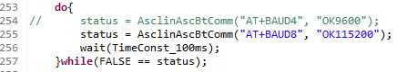

    - HC-06의 보드레이트를 변경하는 명령어다.
    - Aurix_Racer 프로젝트의 디폴트 보드레이트는 **115200**이기 때문에 명령어를 **AT+BAUD8**로 설정한다.

  |  명령어  | 보드레이트 |  명령어  | 보드레이트 |
  | :------: | :--------: | :------: | :--------: |
  | AT+BUAD1 |    1200    | AT+BUAD2 |    2400    |
  | AT+BUAD3 |    4800    | AT+BUAD4 |    9600    |
  | AT+BUAD5 |   19200    | AT+BUAD6 |   38400    |
  | AT+BUAD7 |   57600    | AT+BUAD8 |   115200   |

- **1_ToolEnv >> 0_Build >> 1_Config **폴더에 있는 **Config.xml** 파일의 **branches** 를 **AsclinAscBt**로 변경한다.

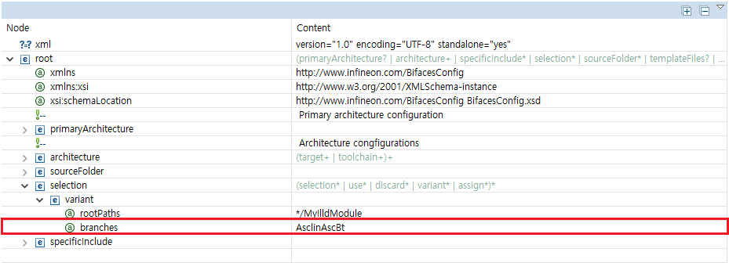

- 프로젝트를 빌드 해서 다운로드 후 실행 시킨다.

- **보드레이트 변경 성공**

  -  **Simulated I/O**창에서 아래와 같이 나타난다.

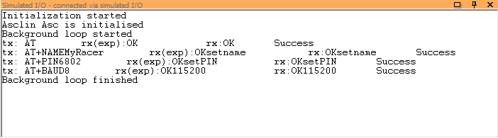

- **보드레이트 변경 실패**

  - **Simulated I/O**창에서 아래와 같이 나타난다.
  - Fail은 보통 HC-06과 TC275보드의 보드레이트가 안 맞거나, 데이터 전송 중에 문제가 생겨서 일어나기 때문이다. 
  - 이경우 프로그램을 다시 실행해 보거나, HC-06과 TC275보드의 보드레이트를 확인한다.

  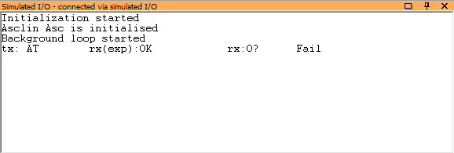

  - HC-06의 장치 이름이 성공적으로 수정된 것이 확인된다.

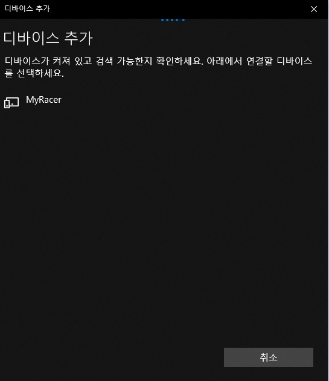

  ### NOTE

  - **향후에 HC-06의 보드레이트 변경하려면, TC275보드의 보드레이트를 115200으로 설정해야한다.**

## AurixRacer 블루투스 사용하기

- **AurixRacer_TC27D** 프로젝트를 Import

  - [Getting Started](https://github.com/realsosy/AurixRacer/blob/master/docs/GettingStarted.md)를 참고한다.

- ASCLIN 모듈 서비스 타입 변경

  - Project explorer창에서 **0_Src >> AppSw >> Tricore>> Cfg_Illd** 안에 있는 **Configuration.h** 파일을 연다.

  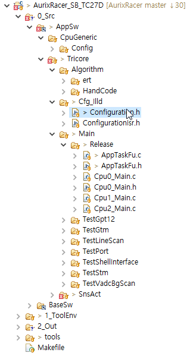

  - AurixRacer_TC27D의  Asclin 통신 모듈의 서비스 타입은 **ASCLIN3**로 설정되어있다.

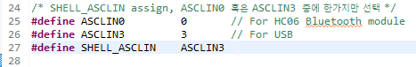

  - ASCLIN3은 USB 통신 포트와 연결 되어있다.

  - 블루투스 모듈과 연결 가능한 포트의 서비스 타입은 **ASCLIN0**이기 때문에 서비스 타입을 변경시켜줘야 한다.

  - "#define SHELL_ASCLIN	**ASCLIN3**" 을 "#define SHELL_ASCLIN	**ASCLIN0**"으로 변경

- 설정 변경이 완료되면 프로젝트를 빌드 후 다운로드 하고, 실행한다.

- Tera Term과 블루투스 직렬 통신

  - TeraTerm을 열어 블루투스 직렬 링크와 연결시킨다.

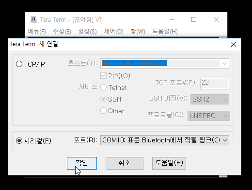

  - 시리얼포트 설정(**메뉴 >> 설정 >> 시리얼포트**)에서 보드레이트를 변경한다.

  - TeraTerm VT창에서 enter를 입력하면 **Shell>**이 화면에 나타난다. 여기에 info를 입력하고 enter를 입력하면 **Welcome to Aurix Racer Shell**이 확인 가능하다.

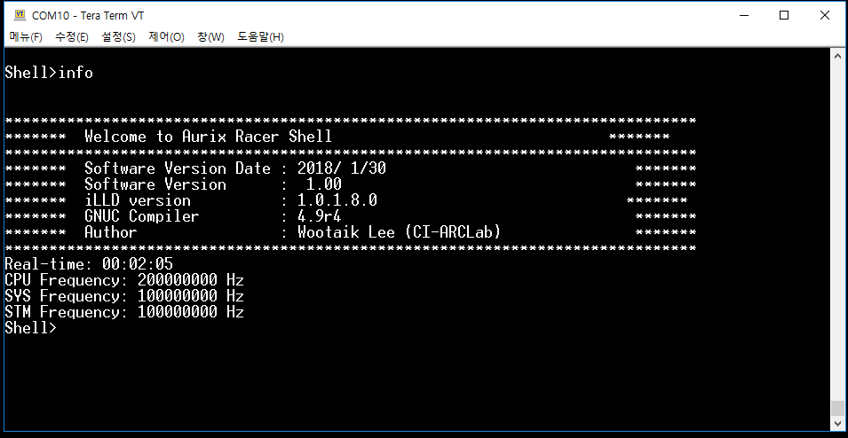
