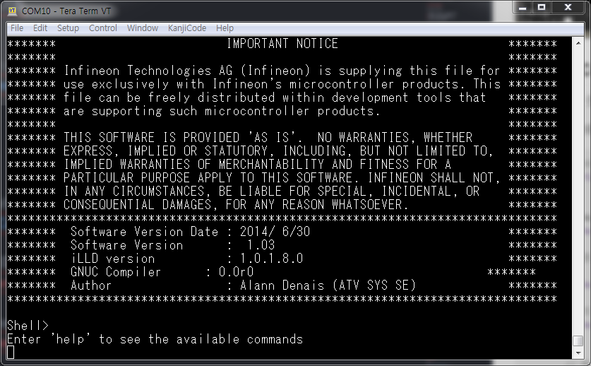
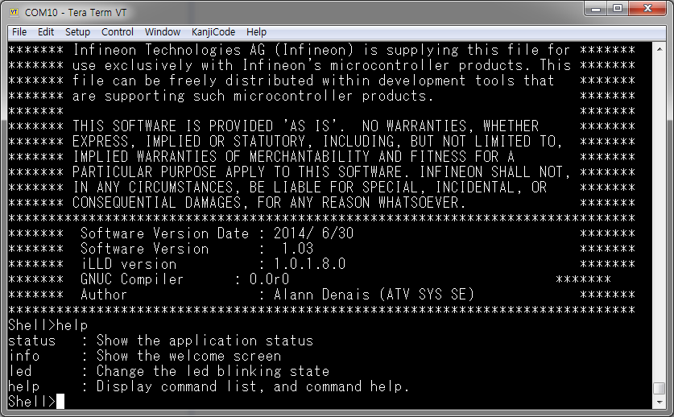

# My own terminal

## 시작하는 질문

* 터미날(Terminal), 쉘(Shell), 이런 것들이 뭐지?  이것이 왜 필요하지?


Window로 컴퓨터를 처음 접한 세대에게는 좀 낯설은 단어일 수 있습니다.  Window 로 대표되는 GUI 환경으로 컴퓨터를 사용하기 이전 시대에는 검은색 텍스트 창에 키보드로 타이핑을 하면서 컴퓨터를 사용했었습니다.  물론 그 시대에는 마우스도 없었습니다.  화려하지는 않지만, GUI 처럼 직관적이지는 않지만 지금 GUI로 하는 모든 조작을 다 했었습니다.  몇몇 작업들은 지금도 GUI 보다 텍스트 기반의 환경으로 하는 것이 훨씬 효율적입니다.  그중에 대표적인 것이 프로그래밍 입니다.  현재의 프로그래밍 작업환경은 예전의 텍스트 환경으로 했던 것들을 여러개의 윈도우를 사용해서 잘 정리해서 보여주는 것입니다.  내부적으로는 역시 텍스트 기반의 정보들이 움직이고 있습니다.  대표적으로 eclipse 의 console 창이 컴파일을 포함한 빌드 과정을 이러한 방식으로 보여주는 것입니다.

Window 의 cmd과 powershell, Linux의 sh, bash 같은 텍스트 기반의 사용환경을 쉘이라고 부릅니다.  이 쉘에서 제공하는 명령어들을 사용해서 컴퓨터를 조작할 수 있게 됩니다.  파일과 디렉토리 조작, 때로는 간단한 스크립트 언어를 제공해서 프로그래밍을 할 수도 있어서, 컴퓨터를 편하게 사용할 수 있는 기본 환경이 됩니다.  네트워크나 통신으로 원격으로 다른 컴퓨터의 쉘에 접속하여 조작하는 환경을 터미날이라 부릅니다.  Tera term, 혹은 putty 와 같은 터미날 프로그램이 많이 사용되고 있습니다.

컴퓨터의 쉘과 같은 환경이 임베디드 시스템에서도 꼭 필요할까요?  꼭 필요하지는 않습니다.  개발 단계에서는 터미날 보다 전용 디버거를 사용하는 것이 훨씬 효율적입니다.  그러나 시스템 시험단계, 혹은 유지보수를 하는 단계에서는 디버거를 연결하는 것이 어렵거나 불가능 할 수 있습니다.  이런 경우에는 통신을 통하여 기본적인 조작을 할 수 있는 쉘을 사용할 수 있도록 하는 것이 바람직 합니다.  결론적으로 쉘을 꼭 프로그래밍 할 필요는 없습니다.  그러나 몇몇 환경에서는 약간의 노력(?)을 들여서 쉘을 구성해 놓는 다면, 향후 시스템을 운영할 때, 유지보수 할 때 매우 유용하게 사용할 수 있습니다.

(참고) 일반적인 네트워크, 이더넷이나 USB, SCI 등, 를 사용하지 않는 자동차의 제어시스템에서는 CAN 네트워크를 통하여 접속할 수 있는 환경을 구성합니다.  자동차 업계에서는 이런 접속 환경을 용도에 맞게 더욱 세분화 하여서 전용 프로그램을 별도로 사용하기도 합니다.


## Objectives

* Shell의 유용성을 이해하고 구성하는 방법을 익힌다.


## References

* iLLD_TC23A_1_0_1_8_0 - Modules/Service software/System Engineering/Communication/Shell
* iLLD_TC23A_1_0_1_8_0 - Modules/Service software/Standard interface: Data Pipe
* iLLD_TC27D_1_0_1_8_0 - Modules/Service software/System Engineering/Communication/Shell
* iLLD_TC27D_1_0_1_8_0 - Modules/Service software/Standard interface: Data Pipe
* [Hello World](./HelloWorld.md)

**[Example Code]**

* MyIlldModule_AK_TC23A - AsclinShell
* MyIlldModule_SB_TC27D - AsclinShell


## Example Description

다음의 기능을 수행하는 쉘을 구성한다.

* Booting 시, 혹은 "info"  명령 입력시 초기화면을 출력한다.
* " status " 명령 입력시 시스템의 정보를 출력한다.
* " led " 명령 입력으로 Led blinking 기능을 제어한다.
* " help " 명령 입력시 도움말을 출력한다.


## Background 정보

* 하드웨어 추상화 계층 (Hardware Abstraction Layer)
    * 물리적인 하드웨어와 실행되는 소프트웨어 사이에 존재
    * 하드웨어를 제어하기 위한 중간계층으로 하드웨어에 연관되어 설계
    * 사용자 입장에서 응용프로그램을 동작시키기 위해 하드웨어에 일일히 대응하지 않아도 됨


- Shell의 계층적 구조
    * 통신모듈인 경우 한 하드웨어에서 여러 종류의 통신방식을 제공하고,
    * 모듈과 프로토콜에 따라 대응을 해줘야하기 때문에,
    * 사용자 입장에서 일관된 인터페이스로 통신하기 위해 한단계의 추상화 과정을 더 거친다.
    * Standard interface > Data Pipe를 통해 통신 계층을 한번 더 추상화하고,
    * Shell을 통해서 송신 혹은 수신되는 data들을 data-pipe interface를 통해 관리


* Standard interface
    * 추상화를 통해 프로그램 구성을 도와주는 iLLD 내부 인터페이스 모듈


## AURIX - related

* 이번 예제에서 쉘은 아래 계층으로 Asc 모듈을 사용

## iLLD - related

### Shell 개요

- 통신을 이용하여 사용자가 입력하는 명령을 확인하고 이에 대응되는 명령을 수행
    * Call-back 함수인 command를 정의하여 명령을 수행한다.
    * Data pipe를 통하여 입력되는 명령어를 수신하고 그것이 사전에 정의된 명령일 때,
    * 미리 정의된 command에 따라서 대응대는 동작을 행한다.


* Command
    * Callback 함수로 구현되며,
    * {이름(call), 도움말, &data, &handler} 의 형태로 정의되어,
    * Shell을 통해 들어온 data가 call을 만족할 때 handler함수를 실행하는 구조


- 예를들어,
    * 사용자가 shell을 동작시키고 "info"라는 입력을 준다면,
    * 입력된 데이터와 사전 정의된 command를 비교하다가: ```g_AsclinShellInterface```
    * 사전정의된 "info"라는 명령어가 입력된 것을 확인하면 그에 맞는 handler 함수를 수행 : ```AppShell_info```


```c
  // in AsclinShellInterface.c
  const Ifx_Shell_Command AppShell_commands[] = {
      {"status", "   : Show the application status", &g_AsclinShellInterface,       &AppShell_status,    },
      {"info",   "   : Show the welcome screen",   &g_AsclinShellInterface,       &AppShell_info,      },
      {"led", "      : Change the led blinking state", &g_AsclinShellInterface,       &AppShell_led,    },
      {"help",   SHELL_HELP_DESCRIPTION_TEXT,        &g_AsclinShellInterface.shell, &Ifx_Shell_showHelp, },
      IFX_SHELL_COMMAND_LIST_END
  };
  ```

* Terminal에 연결 후 실행하거나 info 명령어를 넣었을 때 나오는 화면



* "help" command를 입력하면 설정된 함수에 의해 다음과 같이 정의된 command에 대한 설명들이 표시된다.




### Module Configuration

* Asc 통신 관련 초기화 생략

- 추상화 계층(data pipe)을 통해 시리얼 통신과 shell을 연결

```c
// in AsclinShellInterface.c
void initSerialInterface(void)
{
    {
        IfxAsclin_Asc_Config config;

        // TC237의 경우 ASCLIN0, shield buddy의 경우 ASCLIN3을 사용

        #if BOARD == APPLICATION_KIT_TC237
          IfxAsclin_Asc_initModuleConfig(&config, &MODULE_ASCLIN0);
        #elif BOARD == SHIELD_BUDDY
          IfxAsclin_Asc_initModuleConfig(&config, &MODULE_ASCLIN3);
        #endif
          config.baudrate.baudrate             = CFG_ASC0_BAUDRATE;
          config.baudrate.oversampling         = IfxAsclin_OversamplingFactor_16;
          config.bitTiming.medianFilter        = IfxAsclin_SamplesPerBit_three;
          config.bitTiming.samplePointPosition = IfxAsclin_SamplePointPosition_8;

        #if BOARD == APPLICATION_KIT_TC237        
          config.interrupt.txPriority    = ISR_PRIORITY_ASC_0_TX;
          config.interrupt.rxPriority    = ISR_PRIORITY_ASC_0_RX;
          config.interrupt.erPriority    = ISR_PRIORITY_ASC_0_EX;
        #elif BOARD == SHIELD_BUDDY
          config.interrupt.txPriority    = ISR_PRIORITY_ASC_3_TX;
          config.interrupt.rxPriority    = ISR_PRIORITY_ASC_3_RX;
          config.interrupt.erPriority    = ISR_PRIORITY_ASC_3_EX;
        #endif

	// 중간 생략

        IfxAsclin_Asc_initModule(&g_AsclinShellInterface.drivers.asc, &config);

        // 초기화한 asc 설정을 data pipe와 connect
        IfxAsclin_Asc_stdIfDPipeInit(&g_AsclinShellInterface.stdIf.asc, &g_AsclinShellInterface.drivers.asc);
    }

	// 중간 생략

}
```


* Shell interface 초기화

```c
// in AsclinShellInterface.c
void AsclinShellInterface_init(void)
{

	//중간 생략

    {
        Ifx_Shell_Config config;
        Ifx_Shell_initConfig(&config);

        // 어떤 통신으로 데이터를 주고 받을 것인가
        config.standardIo     = &g_AsclinShellInterface.stdIf.asc;

        // 어떤 command를 사용할 것인가
        config.commandList[0] = &AppShell_commands[0];

        Ifx_Shell_init(&g_AsclinShellInterface.shell, &config);
    }
}
```

### Interrupt Configuration

* 인터럽트를 보드에 맞게 설정된 통신 채널에 따라 설정

```c
// in AsclinShellInterface.c

#if BOARD == APPLICATION_KIT_TC237

IFX_INTERRUPT(asclin0TxISR, 0, ISR_PRIORITY_ASC_0_TX)
{
    IfxAsclin_Asc_isrTransmit(&g_AsclinShellInterface.drivers.asc);
}

IFX_INTERRUPT(asclin0RxISR, 0, ISR_PRIORITY_ASC_0_RX)
{
    IfxAsclin_Asc_isrReceive(&g_AsclinShellInterface.drivers.asc);
}

IFX_INTERRUPT(asclin0ErISR, 0, ISR_PRIORITY_ASC_0_EX)
{
    IfxAsclin_Asc_isrError(&g_AsclinShellInterface.drivers.asc);
}

#elif BOARD == SHIELD_BUDDY

IFX_INTERRUPT(asclin3TxISR, 0, ISR_PRIORITY_ASC_3_TX)
{
    IfxAsclin_Asc_isrTransmit(&g_AsclinShellInterface.drivers.asc);
}

IFX_INTERRUPT(asclin3RxISR, 0, ISR_PRIORITY_ASC_3_RX)
{
    IfxAsclin_Asc_isrReceive(&g_AsclinShellInterface.drivers.asc);
}

IFX_INTERRUPT(asclin3ErISR, 0, ISR_PRIORITY_ASC_3_EX)
{
    IfxAsclin_Asc_isrError(&g_AsclinShellInterface.drivers.asc);
}


```


### Shell 동작

```c
// in AsclinShellInterface.c
void AsclinShellInterface_run(void)
{
    Ifx_Shell_process(&g_AsclinShellInterface.shell);
}
```
**[주의]**

* 이러한 서비스는 본래의 제어를 방해해선 안되며,
* Schedule의 비는 시간에 동작해야 한다.
* 각각의 command 역시 같은 맥락에서 최대한 짧고 간결하게, 꼭 필요한 동작만.


## 추가적인 설명

### LED blinking command 추가

* 기본 Shell demo code에는 없는 led 제어에 대한 command를 추가해보자
  * 이전에 진행했던 STM을 바탕으로 led blinking 기능을 추가하고,
  * Shell을 통해 기능의 on/off signal을 송신.

1. STM의 blinking code에 on/off 동작을 수행할 flag를 추가
```c
//in BasicStm.c
boolean Blink_flag = FALSE;

  // 중간생략

void STM_Int0Handler(void)
{
    IfxStm_clearCompareFlag(g_Stm.stmSfr, g_Stm.stmConfig.comparator);
#ifdef SIMULATION
	IfxStm_increaseCompare(g_Stm.stmSfr, g_Stm.stmConfig.comparator, 1000);
#else
	IfxStm_increaseCompare(g_Stm.stmSfr, g_Stm.stmConfig.comparator, TimeConst_100ms);
#endif
    IfxCpu_enableInterrupts();

    BlinkLed_run(Blink_flag);
}

//in BasicStm.h

  // 중간생략
IFX_EXTERN boolean Blink_flag;

```

2. blinking flag에 접근하는 extern 함수를 추가
```c
//in BasicStm.c
  // 중간생략
void IR_setLedTick(boolean led){
	if(led != FALSE){
		led = TRUE;
	}

	Blink_flag = led;
}

//in BasicStm.h
IFX_EXTERN void IR_setLedTick(boolean led);

```

3. 원하는 기능을 구현하는 shell command를 구성
    * callback 함수를 동작시킬 command를 정의하고,
    * 그 command가 입력되었을 때 기능을 수행할 함수를 구성

```c
//in AsclinShellInterface.c
const Ifx_Shell_Command AppShell_commands[] = {
	// 중간 생략

    {"led", " : Change the led blinking state", &g_AsclinShellInterface, &AppShell_led,  },

	// 중간 생략
};

boolean AppShell_led(pchar args, void *data, IfxStdIf_DPipe *io)
{
	sint32 led;
	if (Ifx_Shell_matchToken(&args, "?") != FALSE)
    {
        IfxStdIf_DPipe_print(io, "  Syntax     : Led tick 0/1"ENDL);
    }
    else
    {
    	if(Ifx_Shell_parseSInt32(&args, &led) != FALSE){
    		IR_setLedTick((boolean)led);
    	}
    	IfxStdIf_DPipe_print(io, "  Led tick: %4d "ENDL, Blink_flag);
    }

    return TRUE;
}

```
* 이러한 기능을 잘 이용한다면 차량의 내부 상태를 shell을 이용해 관측할 수도 있지 않을까?
* 그렇다면 차량의 analog 데이터는 어떤 식으로 board 안으로 들어오는 것이지?

- 답은 앞으로 진행할 예제들을 통해 얻을 수 있다.

## 마치며...

목표 지점에 빨리 도달해야 겠다는 욕심으로 최종 결과물에만 집중하게 됩니다.  작은 일이면, 그리고 그 일을 한번만 할 것이라면, 좌우를 살피지 않고 앞만 보고 달려가는 것이 최선입니다.  그러나, 작지 않은 일이어서 중간에 몇번 쉬어야 하는 일이라면, 그리고 그 일을 계속 반복적으로 할 것이라면, 달려가기 전에 한번 생각해 보아야 합니다.  '일을 어떻게 나누어야지?', '이 일을 좀 더 효율적으로 할 수 있는 방법은 없을까?' 등등의 고민을 해야 합니다.  반복적으로 해야 하는 일이라면 효율적인 환경과 도구를 만들어 두는 것이 결과적으로는 더욱 빨리 최종 결과물을 만들 수 있는 방법입니다.

'Shell' 이 바로 그런 도구 입니다.  최종 결과물의 핵심 기능은 아니지만, 좋은 결과물을 만들어 낼 때 활용할 수 있는 좋은 도구가 됩니다.  이 프로젝트에서도 'Shell'을 적극적으로 사용할 것입니다.  귀찮지만, 그 수고러움은 편의성으로 충분히 보상됩니다.

[](https://github.com/realsosy/aurixtutorial)
